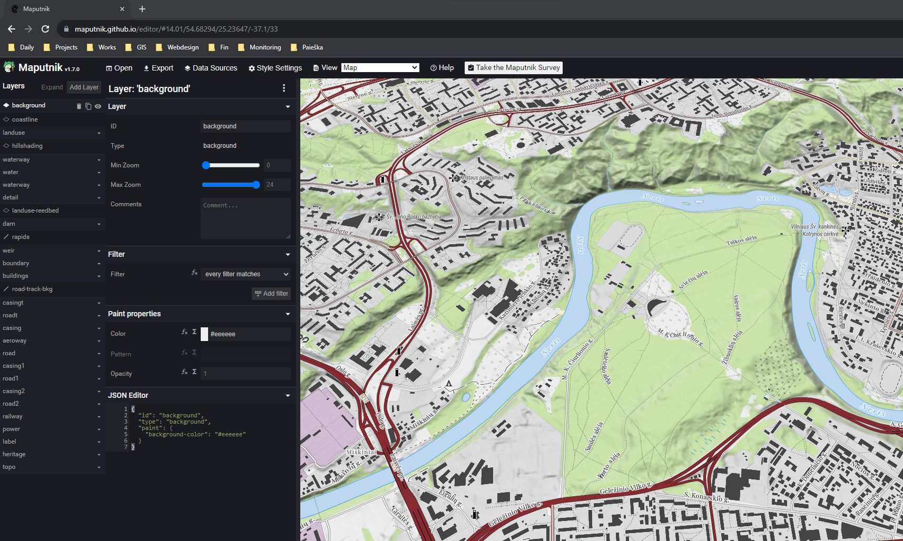

## 1 - Vektorinės išklotinės (vector tiles)

### Apie technologiją

Vector tiles technologija:

- Technologija leidžianti nedideliais kvadratais (angl. tiles) perduoti erdvinius duomenis į žemėlapių naršyklę ar kitą kliento programinę įrangą
- Vector Tiles saugojimo principas panašus į el. paslaugų teikiamų naudojant podėlį principą, t. y. duomenys išsaugojami arba teikiami dinamiškai kaip failai serverio direktorijose (z/x/y struktūroje), tik patys failai yra ne rastriniai, o skirti vektoriniams duomenims pavaizduoti
- Pagrindinis išskirtinumas ir privalumas - žemėlapių naršyklė gauna vektorinius duomenis ir juos vizualizuoja klientinėje dalyje, t. y. duomenų šaltinis vienas, o stilių daug.
- Vector tiles vizualizavimas apima visą kartografinės raiškos galimybių gamą: nuo sluoksnių skirtingiems masteliams įjungimo/išjungimo, iki užrašų ir jų šriftų parinkimo, skirtingų ikonų naudojimo ir pan.

### Darbas su vector tiles

Praktinių užsiėmimų metu naudojami įrankiai ir stiliai:

- Mapbox Vector Tiles [specifikacija](https://docs.mapbox.com/vector-tiles/specification/)
- Maputnik - Vector Tiles [redagavimo priemonė](https://maputnik.github.io/editor/#14.56/54.67138/25.0877)
- Pradiniai Topo žemėlapio stiliai (pridėti stilių json failai)

### Ačiū

Ačiū asociacija Atviras žemėlapis ir ypač Tomui, už suteiktą galimybę pasinaudoti publikuojamu [openstreetmap.org](https://www.openstreetmap.org) vektorinių kaladėliu servisu ir baziniais [openmap.lt](https://www.openmap.lt) stiliais.
